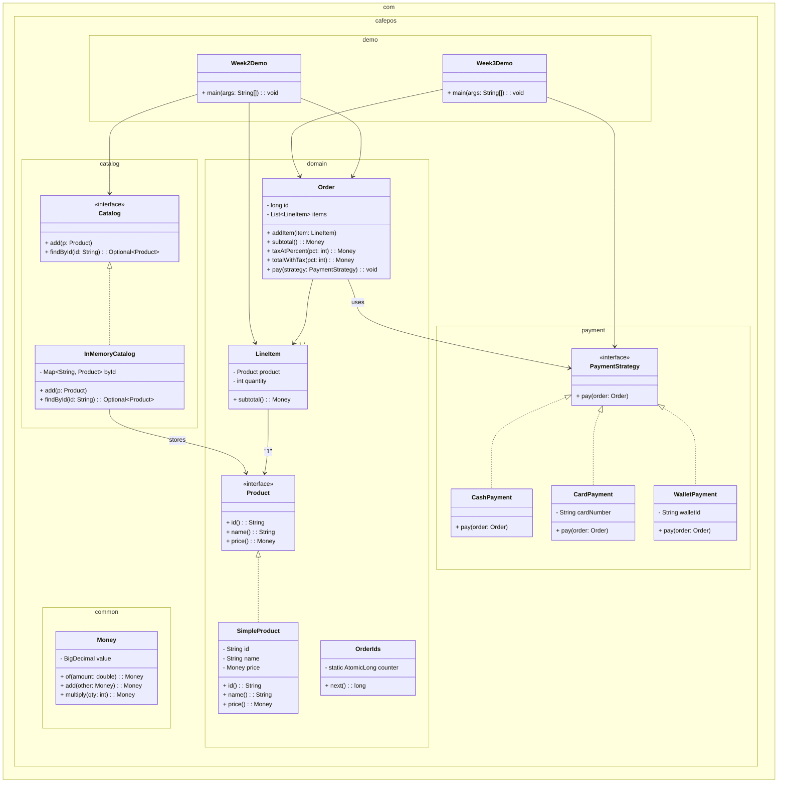

```mermaid
classDiagram

namespace com.cafepos.common {
    class Money {
        - BigDecimal value
        + of(amount: double) : Money
        + add(other: Money) : Money
        + multiply(qty: int) : Money
    }
}

namespace com.cafepos.domain {
    class Product {
        <<interface>>
        + id() : String
        + name() : String
        + price() : Money
    }

    class SimpleProduct {
        - String id
        - String name
        - Money price
        + id() : String
        + name() : String
        + price() : Money
    }

    class LineItem {
        - Product product
        - int quantity
        + subtotal() : Money
    }

    class Order {
        - long id
        - List~LineItem~ items
        + addItem(item: LineItem)
        + subtotal() : Money
        + taxAtPercent(pct: int) : Money
        + totalWithTax(pct: int) : Money
        + pay(strategy: PaymentStrategy) : void
    }

    class OrderIds {
        - static AtomicLong counter
        + next() : long
    }
}

namespace com.cafepos.catalog {
    class Catalog {
        <<interface>>
        + add(p: Product)
        + findById(id: String) : Optional~Product~
    }

    class InMemoryCatalog {
        - Map~String, Product~ byId
        + add(p: Product)
        + findById(id: String) : Optional~Product~
    }
}

namespace com.cafepos.payment {
    class PaymentStrategy {
        <<interface>>
        + pay(order: Order)
    }

    class CashPayment {
        + pay(order: Order)
    }

    class CardPayment {
        - String cardNumber
        + pay(order: Order)
    }

    class WalletPayment {
        - String walletId
        + pay(order: Order)
    }
}

namespace com.cafepos.demo {
    class Week2Demo {
        + main(args: String[]) : void
    }
    class Week3Demo {
        + main(args: String[]) : void
    }
}

%% 关系
Product <|.. SimpleProduct
Catalog <|.. InMemoryCatalog
PaymentStrategy <|.. CashPayment
PaymentStrategy <|.. CardPayment
PaymentStrategy <|.. WalletPayment

LineItem --> Product : "1"
Order --> "1..*" LineItem
InMemoryCatalog --> Product : stores
Order --> PaymentStrategy : uses
Week2Demo --> Catalog
Week2Demo --> Order
Week2Demo --> LineItem
Week3Demo --> Order
Week3Demo --> PaymentStrategy
```
