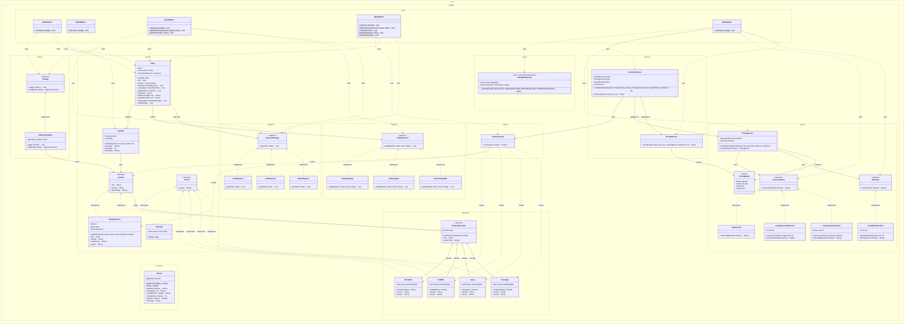

```mermaid
classDiagram

namespace com.cafepos.common {
    class Money {
        - BigDecimal amount
        + of(amount: double) : Money$
        + zero() : Money$
        + add(other: Money) : Money
        + multiply(qty: int) : Money
        + multiply(factor: double) : Money
        + compareTo(o: Money) : int
        + equals(o: Object) : boolean
        + toString() : String
    }
}

namespace com.cafepos.domain {
    class Product {
        <<interface>>
        + id() : String
        + name() : String
        + basePrice() : Money
    }

    class Priced {
        <<interface>>
        + price() : Money
    }

    class SimpleProduct {
        - String id
        - String name
        - Money basePrice
        + SimpleProduct(id: String, name: String, basePrice: Money)
        + id() : String
        + name() : String
        + basePrice() : Money
        + price() : Money
    }

    class LineItem {
        - Product product
        - int quantity
        + LineItem(product: Product, quantity: int)
        + product() : Product
        + quantity() : int
        + lineTotal() : Money
    }

    class Order {
        - long id
        - List~LineItem~ items
        - List~OrderObserver~ observers
        + Order(id: long)
        + id() : long
        + items() : List~LineItem~
        + register(o: OrderObserver) : void
        + unregister(o: OrderObserver) : void
        + addItem(item: LineItem) : void
        + subtotal() : Money
        + taxAtPercent(pct: int) : Money
        + totalWithTax(pct: int) : Money
        + pay(strategy: PaymentStrategy) : void
        + markReady() : void
    }

    class OrderIds {
        - static AtomicLong counter
        + next() : long$
    }
}

namespace com.cafepos.decorator {
    class ProductDecorator {
        <<abstract>>
        # Product base
        # ProductDecorator(base: Product)
        + id() : String
        + basePrice() : Money
    }

    class ExtraShot {
        - static Money SURCHARGE
        + ExtraShot(base: Product)
        + name() : String
        + price() : Money
    }

    class OatMilk {
        - static Money SURCHARGE
        + OatMilk(base: Product)
        + name() : String
        + price() : Money
    }

    class Syrup {
        - static Money SURCHARGE
        + Syrup(base: Product)
        + name() : String
        + price() : Money
    }

    class SizeLarge {
        - static Money SURCHARGE
        + SizeLarge(base: Product)
        + name() : String
        + price() : Money
    }
}

namespace com.cafepos.factory {
    class ProductFactory {
        + create(recipe: String) : Product
    }
}

namespace com.cafepos.catalog {
    class Catalog {
        <<interface>>
        + add(p: Product) : void
        + findById(id: String) : Optional~Product~
    }

    class InMemoryCatalog {
        - Map~String, Product~ byId
        + add(p: Product) : void
        + findById(id: String) : Optional~Product~
    }
}

namespace com.cafepos.payment {
    class PaymentStrategy {
        <<interface>>
        + pay(order: Order) : void
    }

    class CashPayment {
        + pay(order: Order) : void
    }

    class CardPayment {
        + pay(order: Order) : void
    }

    class WalletPayment {
        + pay(order: Order) : void
    }
}

namespace com.cafepos.observer {
    class OrderObserver {
        <<interface>>
        + updated(order: Order, event: String) : void
    }

    class KitchenDisplay {
        + updated(order: Order, event: String) : void
    }

    class DeliveryDesk {
        + updated(order: Order, event: String) : void
    }

    class CustomerNotifier {
        + updated(order: Order, event: String) : void
    }
}

namespace com.cafepos.pricing {
    class DiscountPolicy {
        <<interface>>
        + discountOf(subtotal: Money) : Money
    }

    class NoDiscount {
        + discountOf(subtotal: Money) : Money
    }

    class LoyaltyPercentDiscount {
        - int percent
        + LoyaltyPercentDiscount(percent: int)
        + discountOf(subtotal: Money) : Money
    }

    class FixedCouponDiscount {
        - Money amount
        + FixedCouponDiscount(amount: Money)
        + discountOf(subtotal: Money) : Money
    }

    class TaxPolicy {
        <<interface>>
        + taxOn(amount: Money) : Money
    }

    class FixedRateTaxPolicy {
        - int percent
        + FixedRateTaxPolicy(percent: int)
        + taxOn(amount: Money) : Money
    }

    class PricingService {
        - DiscountPolicy discountPolicy
        - TaxPolicy taxPolicy
        + PricingService(discountPolicy: DiscountPolicy, taxPolicy: TaxPolicy)
        + price(subtotal: Money) : PricingResult
    }

    class PricingResult {
        <<record>>
        - Money subtotal
        - Money discount
        - Money tax
        - Money total
    }
}

namespace com.cafepos.checkout {
    class ReceiptPrinter {
        + format(recipe: String, qty: int, pr: PricingResult, taxPercent: int) : String
    }

    class CheckoutService {
        - ProductFactory factory
        - PricingService pricing
        - ReceiptPrinter printer
        - int taxPercent
        + CheckoutService(factory: ProductFactory, pricing: PricingService, printer: ReceiptPrinter, taxPercent: int)
        + checkout(recipe: String, qty: int) : String
    }
}

namespace com.cafepos.smells {
    class OrderManagerGod {
        <<note: Code Smells Reference>>
        - static int TAX_PERCENT
        - static String LAST_DISCOUNT_CODE
        + process(recipe: String, qty: int, paymentType: String, discountCode: String, printReceipt: boolean) : String$
    }
}

namespace com.cafepos.demo {
    class Week2Demo {
        + main(args: String[]) : void$
    }
    class Week3Demo {
        + main(args: String[]) : void$
    }
    class Week4Demo {
        + main(args: String[]) : void$
        - addItemToOrder(scanner, catalog, order) : void$
        - payOrder(scanner, order) : void$
    }
    class Week5Demo {
        + main(args: String[]) : void$
        - addCustomDrink(scanner, factory, order) : void$
        - viewOrder(order) : void$
        - payOrder(scanner, order) : void$
        - printReceipt(order) : void$
    }
    class Week6Demo {
        + main(args: String[]) : void$
    }
}

%% Core relationships
Product <|.. SimpleProduct : implements
Product <|.. ProductDecorator : implements
Priced <|.. SimpleProduct : implements
Priced <|.. ExtraShot : implements
Priced <|.. OatMilk : implements
Priced <|.. Syrup : implements
Priced <|.. SizeLarge : implements

%% Decorator pattern
ProductDecorator <|-- ExtraShot : extends
ProductDecorator <|-- OatMilk : extends
ProductDecorator <|-- Syrup : extends
ProductDecorator <|-- SizeLarge : extends
ProductDecorator o-- Product : wraps

%% Catalog
Catalog <|.. InMemoryCatalog : implements

%% Payment Strategy
PaymentStrategy <|.. CashPayment : implements
PaymentStrategy <|.. CardPayment : implements
PaymentStrategy <|.. WalletPayment : implements

%% Observer Pattern
OrderObserver <|.. KitchenDisplay : implements
OrderObserver <|.. DeliveryDesk : implements
OrderObserver <|.. CustomerNotifier : implements

%% Composition relationships
LineItem --> Product : uses
Order --> "*" LineItem : contains
Order --> "*" OrderObserver : notifies
InMemoryCatalog --> "*" Product : stores
Order --> PaymentStrategy : pays with

%% Factory Pattern
ProductFactory ..> Product : creates
ProductFactory ..> SimpleProduct : creates
ProductFactory ..> ExtraShot : creates
ProductFactory ..> OatMilk : creates
ProductFactory ..> Syrup : creates
ProductFactory ..> SizeLarge : creates

%% Week 6 Pricing Relationships
DiscountPolicy <|.. NoDiscount : implements
DiscountPolicy <|.. LoyaltyPercentDiscount : implements
DiscountPolicy <|.. FixedCouponDiscount : implements
TaxPolicy <|.. FixedRateTaxPolicy : implements

PricingService --> DiscountPolicy : uses
PricingService --> TaxPolicy : uses
PricingService --> PricingResult : produces

%% Week 6 Checkout Relationships
CheckoutService --> ProductFactory : uses
CheckoutService --> PricingService : delegates to
CheckoutService --> ReceiptPrinter : delegates to
ReceiptPrinter --> PricingResult : formats

%% Demo dependencies
Week2Demo ..> Catalog : uses
Week2Demo ..> Order : uses
Week2Demo ..> LineItem : uses
Week3Demo ..> Order : uses
Week3Demo ..> PaymentStrategy : uses
Week4Demo ..> Catalog : uses
Week4Demo ..> Order : uses
Week4Demo ..> OrderObserver : uses
Week4Demo ..> PaymentStrategy : uses
Week5Demo ..> ProductFactory : uses
Week5Demo ..> Order : uses
Week5Demo ..> PaymentStrategy : uses
Week6Demo ..> OrderManagerGod : uses
Week6Demo ..> CheckoutService : uses
Week6Demo ..> PricingService : uses
Week6Demo ..> DiscountPolicy : uses
Week6Demo ..> TaxPolicy : uses
Week6Demo ..> ReceiptPrinter : uses
```
