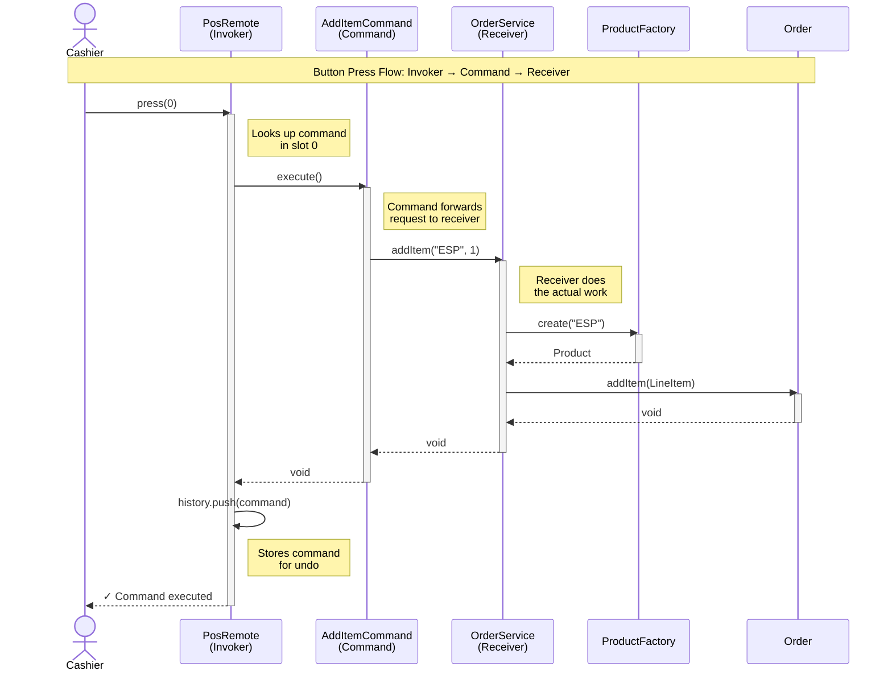
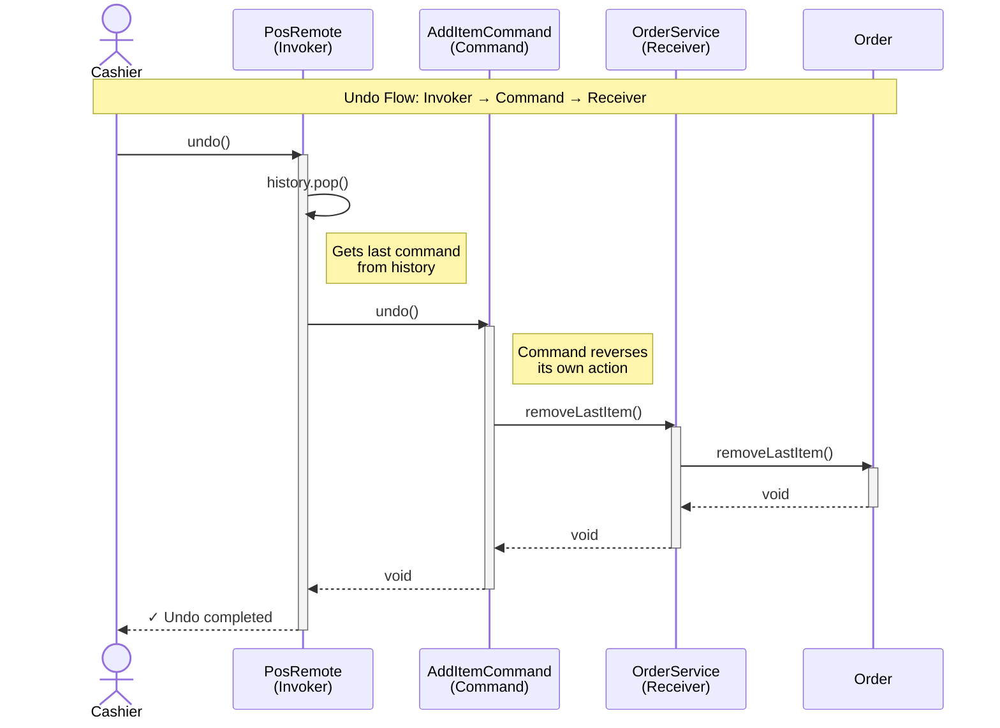
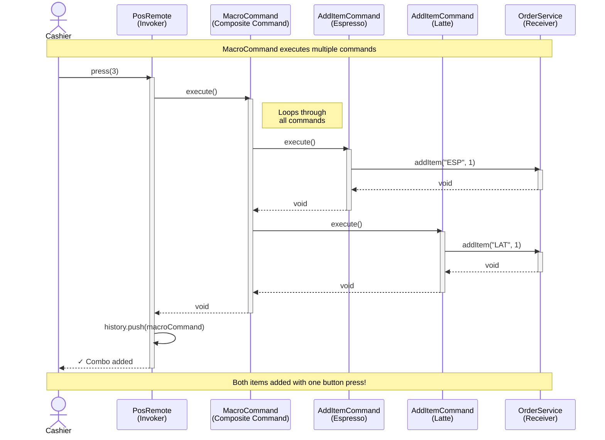

# Command Pattern - Sequence Diagram

## Cashier Adds an Item to Order

## Roles

**Cashier (Actor):**

- Initiates the action by pressing a button

**PosRemote (Invoker):**

- Holds command slots (buttons)
- Knows which command is in each slot
- Executes commands without knowing what they do
- Maintains command history for undo

**AddItemCommand (Command):**

- Encapsulates the request as an object
- Knows which receiver to call
- Stores parameters (recipe, quantity)
- Acts as a "translator" between invoker and receiver

**OrderService (Receiver):**

- Knows HOW to perform the actual work
- Coordinates with domain objects (ProductFactory, Order)
- Keeps business logic separate from UI concerns

**Domain Objects (ProductFactory, Order):**

- The actual business objects that do the work
- Commands never directly access these - always through the receiver

## Undo Flow

## MacroCommand Flow

